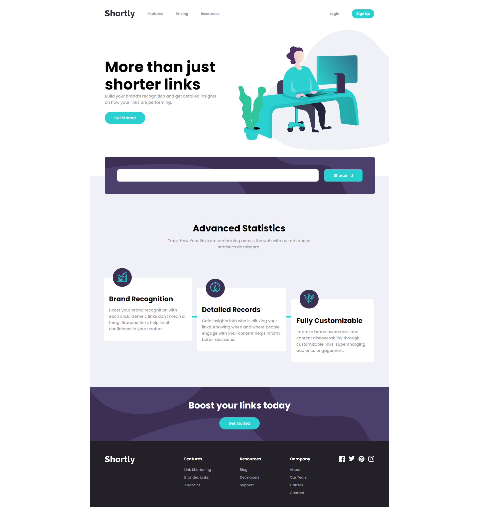
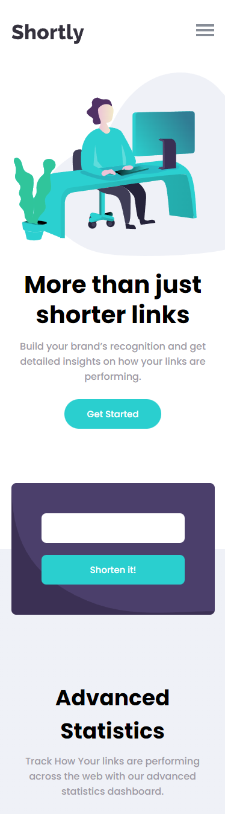

<p align="center">
  <image
  src="https://img.shields.io/github/languages/count/giandefaria/ip-address-tracker-master"
  />
  <image
  src="https://img.shields.io/github/languages/top/giandefaria/ip-address-tracker-master"
  />
  <image
  src="https://img.shields.io/github/last-commit/giandefaria/ip-address-tracker-master"
  />
  <image
  src="https://img.shields.io/github/watchers/giandefaria/ip-address-tracker-master"
  />
</p>

# 📋 Índice do projeto


- [Proposta do projeto](#id01)
- [Desafios](#id02)
- [Arquivos do projeto](#id03)
- [Visual do projeto](#id04)
- [Feito com](#id05)
- [Procedimento de instalação](#id06)
- [Autor](#id07)

# Proposta do projeto <a name="id01"></a>

O layout do projeto é baseado nesse challenge do site Frontend Mentor: https://www.frontendmentor.io/challenges/job-listings-with-filtering-ivstIPCt

A proposta desse projeto consiste em montar uma página que possui uma lista de todos os países, contendo as informações de cada país, além de ser possível realizar a busca de um país por nome ou por região. Foi incrementado no projeto o modo noturno, um mapa que mostra a localização do país no mapa mundi, além de um ícone do wikipedia para ter mais informações sobre o país.


# Desafios <a name="id02"> </a>

Desafio foi criar uma página variável onde se alterasse apenas as informações do país que foi selecionado. Para isso, foi utilizado o react-router-dom e o hook useParams(), de modo que esse valor variável do link fosse capturado e feito uma requisição para a API retornar as informações daquele país, renderizando a página com os elementos HTML e mostrando do mapa a localização do país pela latitude e longitude informada pela API.

# Arquivos do projeto <a name="id03"> </a>

Os principais arquivos do projeto são: 
* diretório pages => localização do arquivo da página inicial (main) e de informação dos países (country-info)
* diretório components => estão localizadas metódos que serão utilizados no projeto: change-light-mode (para mudar tema da página);  crete-html-element-with-list (recebe a lista de países e monta no html); input-country-list (funções que montam a lista de países de acordo com o tipo de busca);
* diretório assets => contém as imagens utilizadas no projeto
* diretório interfaces => contem a interface utilizada no retorno da API, para habilitar o autocomplete e evitar que o desenvolvedor coloque informações que não são retornadas pela API.
* diretório styles => contém os estilos utilizados globalmente no projeto

# Visual do projeto <a name="id04"></a>

<p align="center">

* Design da página principal no desktop
<image
src="./src/assets/design/desktop-preview.jpg"
/>

</p>

<p align="center">

* Design da página principal no celular
<div align="center">
  <image
  src="./src/assets/design/Url-shortenin-api-master-mobile1.png"
  />
</div>

</p>


# 🛠 Feito com <a name="id05"></a>

<br />

- [React](https://reactjs.org/)
- [JavaScript]
- [CSS](https://restcountries.com/)


<br />

# 📝 Procedimentos de instalação <a name="id06"></a>

<br />

Clone este repositório usando o comando:

```bash
git clone https://github.com/giandefaria/url-shortening-api-master.git
```

Na pasta do projeto instale as dependências com uso do npm ou yarn

```bash
npm install
ou
yarn install
```

<br />

# Autor <a name="id07"></a>

<br />

- Frontend Mentor - [@giandefaria](https://www.frontendmentor.io/profile/giandefaria)
- Linkedim - [Gian de Faria](www.linkedin.com/in/gianfaria)
- GitHub - [giandefaria](https://github.com/giandefaria)




* Mobile preview




## Welcome! 👋

Challenge do site frontendmentor.io. https://www.frontendmentor.io/challenges/interactive-comments-section-iG1RugEG9

**O objetivo é criar uuma página integrada a uma API de encurtar links. O principal foco desse projeto é treinar a parte visual e a integração da página com uma API. Projeto desenvolvido com React.**

# Teconologias utilizadas
 * HTML
 * CSS
 * JS
 * React

**no diretório, a página foi divida em três partes (header, main, footer) que são renderizadas dentro do arquivo app.js. Criei o arquivo api.js onde constam os comandos e manipulação de elementos relacionados à API.**

# Getting Started with Create React App

This project was bootstrapped with [Create React App](https://github.com/facebook/create-react-app).

## Available Scripts

In the project directory, you can run:

### `npm start`

Runs the app in the development mode.\
Open [http://localhost:3000](http://localhost:3000) to view it in your browser.

The page will reload when you make changes.\
You may also see any lint errors in the console.

### `npm test`

Launches the test runner in the interactive watch mode.\
See the section about [running tests](https://facebook.github.io/create-react-app/docs/running-tests) for more information.

### `npm run build`

Builds the app for production to the `build` folder.\
It correctly bundles React in production mode and optimizes the build for the best performance.

The build is minified and the filenames include the hashes.\
Your app is ready to be deployed!

See the section about [deployment](https://facebook.github.io/create-react-app/docs/deployment) for more information.

